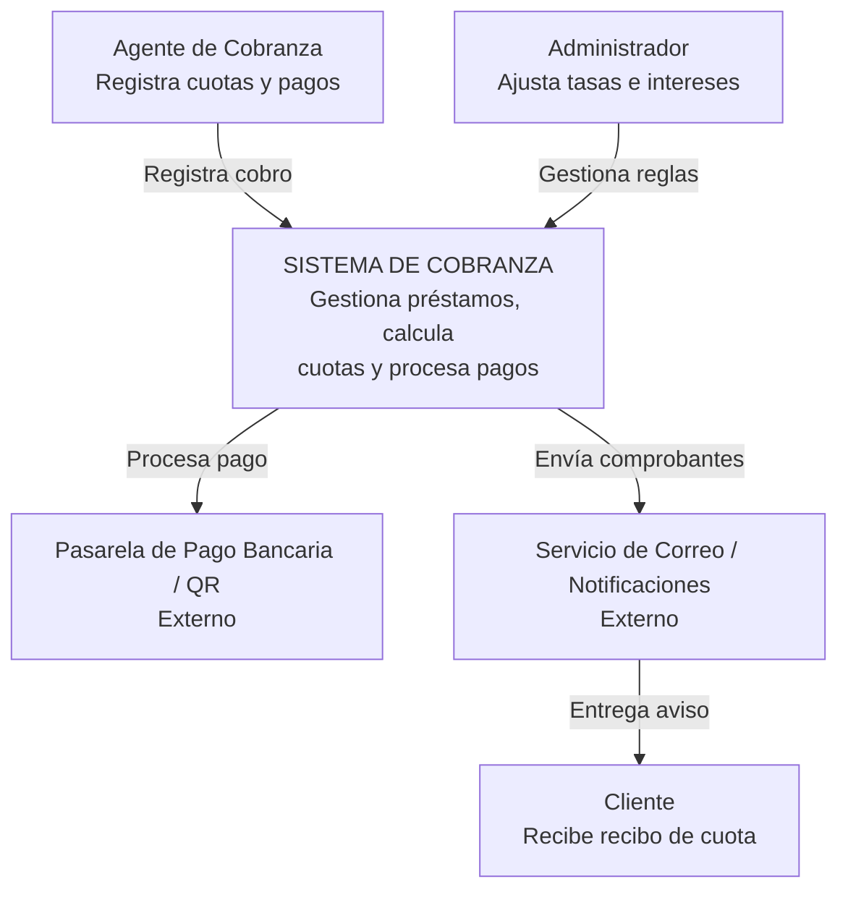
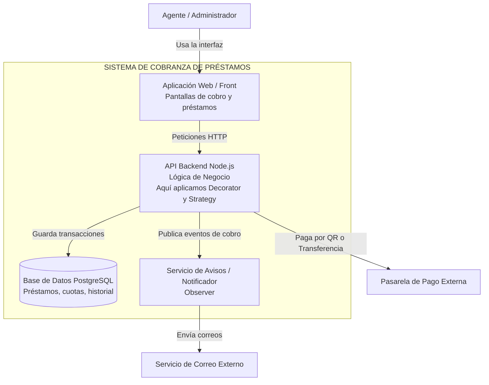

## Nivel 1 

```mermaid
flowchart TD
    A[Agente de Cobranza<br>Registra cuotas y pagos] -->|Registra cobro| B[SISTEMA DE COBRANZA<br>Gestiona préstamos, calcula<br>cuotas y procesa pagos]
    C[Administrador<br>Ajusta tasas e intereses] -->|Gestiona reglas| B
    
    B -->|Procesa pago| D[Pasarela de Pago Bancaria / QR<br>Externo]
    B -->|Envía comprobantes| E[Servicio de Correo / Notificaciones<br>Externo]
    
    E -->|Entrega aviso| F[Cliente<br>Recibe recibo de cuota]
```
## Nivel 2 

```mermaid
flowchart TD
    A[Agente / Administrador] -->|Usa la interfaz| B[Aplicación Web / Front<br>Pantallas de cobro y préstamos]
    
    subgraph SISTEMA DE COBRANZA DE PRÉSTAMOS
        B -->|Peticiones HTTP| C[API Backend Node.js<br>Lógica de Negocio<br>Aquí aplicamos Decorator y Strategy]
        C -->|Guarda transacciones| D[(Base de Datos PostgreSQL<br>Préstamos, cuotas, historial)]
        C -->|Publica eventos de cobro| E[Servicio de Avisos / Notificador<br>Observer]
    end
    
    C -->|Paga por QR o Transferencia| F[Pasarela de Pago Externa]
    E -->|Envía correos| G[Servicio de Correo Externo]
```